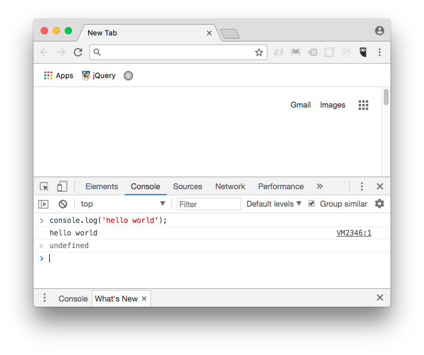
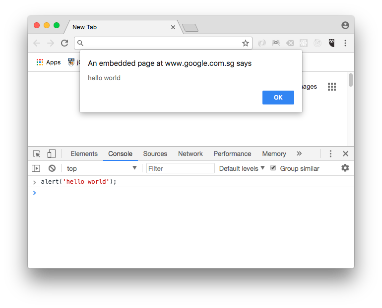

## Developer console

To get started with learning Javascript, probably easiest way is to use the
developer console in your web browser. You can access the developer console,
press F12 (windows/chrome, firefox) or Cmd+Opt+J (mac/chrome).

One of the most common method that you will use to debug your code is
console.log. It is equivalent to the `System.out.println()` in Java. It will
print out the results in the developer console.



Alternatively, you can also use the `alert()` command but pop up an alert box
but can get quite irritating as you end up having to press Ok to continue.

```javascript
alert('hello world');
```



## Semicolons?

Unlike Java/C where we need to terminate each lines with semicolons, in
Javascript, semicolons are optional (**sometimes**) for terminating statements.
I have also come across a number of developers nowadays who prefer not to use
semicolons and just use a line breaks to denote new line.

```javascript
var a = 10;

//this is fine too!
var a = 10;
```

Personally, coming from a Java background, I still prefer terminating my lines
with semicolons. You should note that semicolons are however required for some
situations:

* writing codes in a single line (e.g. `var a = 10; var b = 20;`)
* return statement from a function. You can enclose with `( )` your return value
  is the next line (quite common when coding with
  <a href="https://reactjs.org/" target="_blank">ReactJS</a>)

  <sub>`//prettier-ignore` is to tell
  <a href="https://prettier.io/" target="_blank">Prettier</a> (a code formatter
  software used to write this document) not to prettify the code</sub>

```javascript
/* eslint-disable prettier/prettier */
var a = 10;
var b = 20;

// prettier-ignore
function foo() {
  return
  5;
}
console.log(foo()); //undefined (not 5!)

// prettier-ignore
function foo1() {
  return (
    5
  )
}

console.log(foo1()); //5
```
