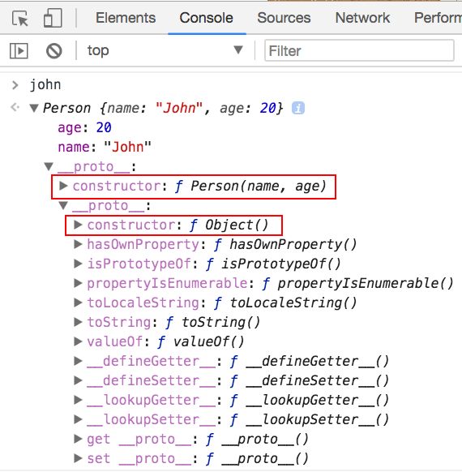
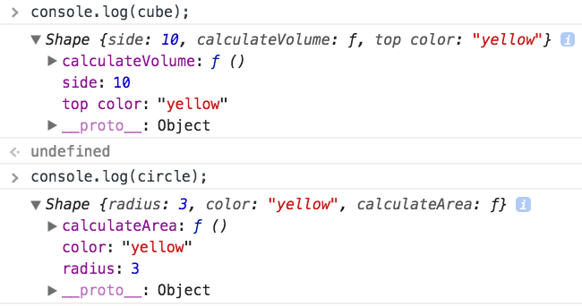
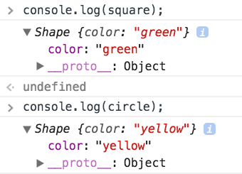
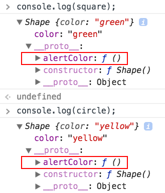
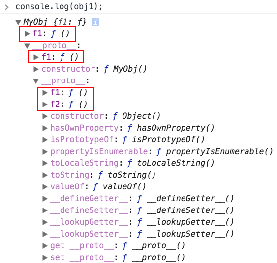

## Object-oriented programming (OOP)

Javascript is a language that supports multiple programming paradigm :
**imperative**, **object-oriented**, **functional**. To create an object, we use
the `new` keyword.

```javascript
//create a date object (current date/time)
var now = new Date();
console.log(now);
```

Before ES6, object definitions are defined using functions. However, these are
special function called function constructor. They are meant to be called using
the `new` keyword instead of called as if they were normal functions.

```javascript
//function constructor
function Person(name, age) {
  this.name = name;
  this.age = age;
}

//function constructor invocation
var john = new Person('John', 20);
console.log(typeof john); //object
console.log(john instanceof Person); //true
console.log(john instanceof Date); //false
console.log(john instanceof Object); //true

//this is not an object
var notObject = Person('Jane', 20);
console.log(typeof notObject); //undefined
```

We have seen the `typeof` operator
[previously](/1-2-variables#variable-declaration-and-assignment). The
`instanceof` operator test the type of the object. Specifically, this is
achieved by going up the the prototype chain of the object and checking for
match in the constructor field. We will discuss
[prototypal inheritance](#prototypal-inheritance) shortly.



## Attributes and methods

As seen earlier, the `this` keyword can be used to assign instance attributes
and methods (e.g. `this.address` and `this.setSGAddress`). If you are familiar
with Java, it is similar to the _public_ access rights.

There is no specific syntax for _private_ access rights of attributes but it is
still possible to achieve the same kind of information hiding. For example, in
the following example, `name` and `age` cannot be accessed directly outside this
class. We can then define getters (accessors) and setters (mutators) to
access/manipulate the attributes accordingly.

```javascript
//function constructor
function Person() {
  var name, age;
  this.address = '';

  this.getName = function() {
    return name;
  };

  this.setName = function(n) {
    name = n;
  };

  this.getAge = function() {
    return age;
  };

  this.setAge = function(a) {
    age = a;
  };

  this.setSGAddress = function(address) {
    this.address = address + ' Singapore';
  };
}

var john = new Person();
john.setName('john');
john.setSGAddress('Clementi');
console.log(john.getName()); //john
console.log(john.address); //Clementi Singapore
```

However, unlike other strongly typed languages, we can add properties
(attributes/methods) to an object even after it has been declared. Each object
has its own copy of a property.

```javascript
function Shape() {}

var circle = new Shape();
circle.radius = 3;
circle.color = 'yellow';
circle.calculateArea = function() {
  return Math.PI * this.radius * this.radius;
};

//Shape {radius: 3, color: "yellow", calculateArea: ƒ}
console.log(circle);

console.log(circle.calculateArea()); //Math.PI * 3 * 3
```

It is also possible to define properties using the `['PROPERTY_NAME]` syntax.
Properties defined this way can contain spaces. To access the property, we can
then use the `.PROPERTY_NAME` or `['PROPERTY_NAME]` syntax. If a property is
defined using `[ ]`, the property can contain spaces.

```javascript
function Shape() {}
var cube = new Shape();
cube['side'] = 10;

var function_name = 'calculateVolume';
//can programmatically define the property name
cube[function_name] = function() {
  return Math.pow(this.side, 3);
};

console.log(cube.side); //10
console.log(cube.calculateVolume()); //1000

cube['top color'] = 'yellow';
console.log(cube['top color']); //yellow
```

Note that it is also possible to replace existing method definition. Javascript
will not prevent you from doing this by default, so you should be careful not to
accidentally reassign methods unncessarily/wrongly.

```javascript
//continue from above example
console.log(cube['calculateVolume']);
// ƒ () {
//   return Math.pow(this.side, 3);
// }

cube.calculateVolume = function() {
  return this.side * this.side * this.side;
};

console.log(cube['calculateVolume']);
// ƒ () {
//   return this.side * this.side * this.side;
// }
```

## Prototypal inheritance

To view all the properties associated with an object, we can do a
`console.log(obj)` and expand the nodes to see the details.



Notice that, since each object has its own own isolated copy of properties, this
might consume unnecessary memory if multiple objects should have the same
definition.

```javascript
function Shape() {}

var yellowCircle = new Shape();
yellowCircle.radius = 3;
yellowCircle.color = 'yellow';
yellowCircle.calculateArea = function() {
  return Math.PI * this.radius * this.radius;
};

var blueCircle = new Shape();
blueCircle.radius = 3;
blueCircle.color = 'blue';
blueCircle.calculateArea = function() {
  return Math.PI * this.radius * this.radius;
};

console.log(yellowCircle.calculateArea === blueCircle.calculateArea); //false
```

While it might be possible to define a function and assign the same method
definition to all the objects, it might become tedious to set it everytime a new
object is declared.

```javascript
//possible to assign to the same function though
function calculateArea() {
  return Math.PI * this.radius * this.radius;
}

yellowCircle.calculateArea = calculateArea;
blueCircle.calculateArea = calculateArea;
console.log(yellowCircle.calculateArea === blueCircle.calculateArea); //true
```

Instead, the better way is to be able to define the set of properties such that
all instances of that type of object would inherit from. In JS, we use
prototypal inheritance to achieve this.

```javascript
function Shape() {}
var square = new Shape();
square.color = 'green';

var circle = new Shape();
circle.color = 'yellow';

Shape.prototype.alertColor = function() {
  alert(this.color);
};

circle.alertColor(); //yellow
square.alertColor(); //green
```

```javascript
function Shape() {}
//this can also be defined before the creation of objects
Shape.prototype.alertColor = function() {
  alert(this.color);
};

var square = new Shape();
square.color = 'green';

var circle = new Shape();
circle.color = 'yellow';

circle.alertColor(); //yellow
square.alertColor(); //green
```

Notice that methods defined this way do not show up as properties in the object.



Instead, the methods are defined under the prototype definition (defined by a
special `__proto__` property).



This prototypal inheritance applies for attributes also.

```javascript
function Person(name) {
  this.name = name;
}

var john = new Person('John');
Person.prototype.MAX_AGE = 99;

var jane = new Person('Jane');

console.log(john.MAX_AGE); //99
console.log(jane.MAX_AGE); //99
```

It is more important to understand how JS resolve the properties. When trying to
access a property _**p**_, it will try to find _**p**_ in its own list of
properties. If _**p**_ cannot be found from its own properties, it will then go
to its prototype (`__proto__` property (parent)) to and try to access _**p**_.
If _**p**_ still cannot be find, it will repeat this process by access the
(`__proto__` property (parent's parent)), etc. Thus, the term **prototype
chain**.

```javascript
function MyObj() {}

var obj1 = new MyObj();
obj1.f1 = function() {
  console.log('obj1.f1');
};

var obj2 = new MyObj();
MyObj.prototype.f1 = function() {
  console.log('MyObj prototype f1');
};

var obj3 = new MyObj();
Object.prototype.f1 = function() {
  console.log('Object prototype f1');
};

Object.prototype.f2 = function() {
  console.log('Object prototype f2');
};

obj1.f1(); //obj1.f1
obj2.f1(); //MyObj prototype f1
obj3.f1(); //MyObj prototype f1

obj1.f2(); //Object prototype f2
obj2.f2(); //Object prototype f2
obj3.f2(); //Object prototype f2
```



There is a `hasOwnProperty()` method that returns true when the object has the
specified property in its own list properties.

```javascript
//Here's a simulation of the process that is performed by the JS engine
function MyObj() {}

var obj1 = new MyObj();
obj1.f1 = function() {
  console.log('obj1.f1');
};

var obj2 = new MyObj();
MyObj.prototype.f1 = function() {
  console.log('MyObj prototype f1');
};

var obj3 = new MyObj();
Object.prototype.f1 = function() {
  console.log('Object prototype f1');
};

Object.prototype.f2 = function() {
  console.log('Object prototype f2');
};

//stepping through the process, it looks something like this:

if (obj1.hasOwnProperty('f1')) {
  //obj1.f1(); //obj1.f1
  console.log('#found f1 in own property');
} else {
  // ...
}

if (obj2.hasOwnProperty('f1')) {
  //...
} else {
  //this is just for illustration purposes
  //you shouldn't be accessing __proto__
  const parent = obj2.__proto__;
  if (parent.hasOwnProperty('f1')) {
    // obj2.f1(); //MyObj prototype f1
    console.log('#found f1 in parent property');
  } else {
    // ...
  }
}

if (obj2.hasOwnProperty('f2')) {
  //...
} else {
  //this is just for illustration purposes
  //you shouldn't be accessing __proto__
  const parent = obj2.__proto__;
  if (parent.hasOwnProperty('f2')) {
    // ...
  } else {
    const parentParent = parent.__proto__;

    if (parentParent.hasOwnProperty('f2')) {
      // obj1.f1(); //Object prototype f2
      console.log("#found f2 in parent's parent property");
    }
  }
}
```

## Object literal notation

JS provides a object literal notation that you can use to define and create
objects. This is often preferred as it makes the codes much shorter and cleaner.

```javascript
var redCircle = {
  radius: 3,
  color: 'red',
  calculateArea: function() {
    return Math.PI * this.radius * this.radius;
  }
};

//{radius: 3, color: "red", calculateArea: ƒ}
console.log(redCircle);
console.log(redCircle.calculateArea());
```

The same rules from before applies for the object literal notation.

```javascript
var circle = {
  radius: 3,
  color: 'red'
};

Object.prototype.foo = function() {
  console.log('foo');
};

circle.foo(); //foo
```

```javascript
var circle = {
  radius: 3,
  color: 'red'
};

//Error: this is not allowed => cannot set property
circle.prototype.foo = function() {
  console.log('circle::foo');
};
```

## Deeper prototype chain

So far, our examples have never gone beyond 2 level of inheritance. In OOP,
sometimes we want to extend a superclass (which probably was extending another
superclass). ECMAScript 5 (ES5) comes with a `Object.create()` method that
allows us to have "deeper" prototype chain.

```javascript
var grandgrandparent = { location4: 'grandgrandparent' };
var grandparent = Object.create(grandgrandparent);
grandparent.location3 = 'grantparent';

var parent = Object.create(grandparent);
parent.location2 = 'parent';

var child = Object.create(parent);
child.location1 = 'child';

console.log(child);
console.log(child.location1); //child
console.log(child.location2); //parent
console.log(child.location3); //grandparent
console.log(child.location4); //grantgrandparent
```

<div>
  <div class='text-left'>
    <a href="/1-4-scoping">Prev: 1.4 Scoping</a>
  </div>

  <div class='text-right'>
    <a href="/1-6-arrays">Next: 1.6 Arrays</a>
  </div>
</div>
